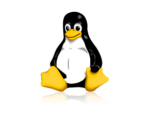

========================================
Basic GNU/Linux commandline applications
========================================

Introduction to GNU
-------------------

**GNU** is an Unix-like computer operating system. "GNU" is 
pronounced g'noo.
GNU is a recursive acronym for "GNU's Not Unix!". It was publicly announced by
Dr. Richard Stallman on January 5, 1984. 

The goal was to bring a wholly free software operating system into existence. [#]_

   
   The GNU logo
	
GNU project outlines 
~~~~~~~~~~~~~~~~~~~~
"Free software" is a matter of liberty, not price. To understand the concept, 
you should think of “free” as in "free speech", not as in "free stuff".

Free software is a matter of the users freedom to run, copy, distribute, study,
change and improve the software. More precisely, it refers to four kinds of 
freedom, for the users of the software:

#. The freedom to run the program, for any purpose (freedom 0).
#. The freedom to study how the program works, and adapt it to your needs 
   (freedom 1). Access to the source code is a precondition for this.
#. The freedom to redistribute copies so you can help your neighbor (freedom 2).
#. The freedom to improve the program, and release your improvements to the 
   public, so that the whole community benefits (freedom 3). Access to the 
   source code is a precondition for this. 

The Hurd, GNU's own kernel [#]_, is some way from being ready for daily use. Thus,
GNU is typically used today with a kernel called Linux. This combination is the
GNU/Linux operating system. GNU/Linux is used by millions, though many call it 
"Linux" by mistake. [#]_

.. [#] http://en.wikipedia.org/wiki/GNU

.. [#] http://en.wikipedia.org/wiki/Kernel_(computing)

.. [#] http://www.gnu.org/#content

The Linux kernel
~~~~~~~~~~~~~~~~

The Linux kernel was initially started by Linus Torvalds. Linux rapidly 
accumulated developers and users who adapted code from other free software 
projects for use with the new operating system. The Linux kernel has received 
contributions from thousands of programmers. [#]_

Today, Linux kernel runs super-computers, servers, mobiles, tablets, TVs, set-top
boxes and many consumer electronics. 

   
   The Linux logo
	

.. [#] http://en.wikipedia.org/wiki/Linux_kernel

|

GNU/Linux distributions
~~~~~~~~~~~~~~~~~~~~~~~

Unlike other operating systems, GNU/Linux doesn't have only one flavor. In fact, 
there are more than thousand variants available. The most popular are listed 
in `distrowatch.com <http://distrowatch.com>`_. You may also be interested in 
the `Linux_distributions <http://en.wikipedia.org/wiki/Linux_distribution>`_ 
wikipedia page. This page showcase the history and development of popular 
GNU/Linux distributions. 

|

.. figure:: data/logos-distros.jpg
   :width: 100% 	  
   
   logos of some GNU/Linux distributions    
	
|

We will be using **Ubuntu** for rest of the discussion. The only reason for 
Ubuntu is its popularity and support. There are many distributions which
are arguably more productive than Ubuntu. 

Ubuntu is based on one of the oldest distribution **Debian**. There are many 
variants of Debian too, Ubuntu is most favoured by beginners. 

On the other hand there are many sub-distributions of Ubuntu too. LinuxMint is
most popular among them. 

|

   
   Linuxmint Desktop

|

In fact, anyone with good understanding of internals of GNU/Linux, 
can either customize or start his own distribution. More comprehensive details
are available at `linuxfromscratch.org <http://www.linuxfromscratch.org/>`_

|

GNU/Linux applications
----------------------

Text based and X-window application
~~~~~~~~~~~~~~~~~~~~~~~~~~~~~~~~~~~

Any GNU/Linux application can be broadly classified into **text based** and **X-window based**.

Text based applications are also known as **command line applications**. Usually, these 
command line applications run inside a Console. In modern GNU/Linux desktops, these applications
are often accessed through **terminal-emulator** programs. 

For example, *vim* is a popular command line application to view/edit text files, similarly 
 *gedit* is the popular X-window based application for text processing. 

Shell and Bash
~~~~~~~~~~~~~~

In computing, a **shell** is a user interface for access to an operating system's services.

Generally, operating system shells use either a command-line interface (CLI) or 
graphical user interface (GUI). We will work with CLI based shell only. 

**Bash**, also known as *Bourne-again shell*, is an advanced Unix shell, which comes 
pre-installed in all modern GNU/Linux distributions. 

Bash can also read commands from a file, called a script (commonly known as Bash script).
Like all Unix shells, it supports filename wildcarding, piping, 
command substitution, variables and control structures for condition-testing 
and iteration. The keywords, syntax and other basic features of the language were all copied
from `sh`. Other features, e.g., history, were copied from csh and ksh. [#]_

We will concentrate on more command line applications. The rest of the tutorial assumes
that you have a *terminal-emulator* running `bash`. 

.. [#] http://en.wikipedia.org/wiki/Bash_%28Unix_shell%29

Why text based applications ?
~~~~~~~~~~~~~~~~~~~~~~~~~~~~~

Its an obvious question occur to all. With all these user friendly
graphical X-window based applications, why one need command based applications ?

The reasons could be the following :

* The output of one application could be sent to other (mostly). 
 
* Low on RAM, CPU and other resources. Ideal for batch conversions and remote access. 

* Applications can be called inside a shell script efficiently. 

* Easy to develop and debug. 

GNU/Linux text based applications
---------------------------------

The following commands are tested in terminal-emulator and Console.
The give precise output with ``Bash``. 

Do not just copy-paste them, read ``man`` pages, ``--help`` to explore
more about each command(application). 

Help, manual and command search
~~~~~~~~~~~~~~~~~~~~~~~~~~~~~~~

#. Print manual page of the application ::

	man man

#. Search your `keywork` in all man pages ::

	apropos copy

#. Access quick help ::

    apropos --help

Basic directory and files
~~~~~~~~~~~~~~~~~~~~~~~~~

#. Change directory ::

	cd /tmp

#. Print present working directory ::

	pwd

#. List files and directories ::

	ls -l /tmp

   ``-l`` long listing

#. Create directories ::
	
	mkdir dir src-dir dest-dir

#. Create files ::

	touch 1.txt 2.txt

#. Remove file(s) ::

    rm -v 1.txt 

   ``-v`` show verbose

#. Remove directory ::

	rm -rv dir/ 
   
   ``-r`` recursive (only for directories and sub-directories)

#. Move/Rename directory ::

    mv -i src-dir/ dest-dir/

   ``-i`` prompt before overwrite

Read, search and find
~~~~~~~~~~~~~~~~~~~~~

#. Print file content on standard output (STDOUT) and exit ::

	cat /etc/lsb-release /etc/bash.bashrc

#. Read and search through text file ::

	less /etc/bash.bashrc

#. Print first line of the file and exit ::

	head -n1 /etc/bash.bashrc

   ``-n[K]`` Print first `K` lines of the file
   ``-c[K]`` Print first `K` bytes of the file

#. Print last line of the file and exit, command line flags similar to `head` ::

	tail -n1 /etc/bash.bashrc

#. Find files in the directory ::

	find ~/Downloads -iname \*.pdf -size +4M
 
   ``-iname`` name of the file (ignore case)
   ``-size`` file size larger than 4MB 

#. Search lines in text file ::

	grep 'nobody' /etc/passwd

#. Search recursively in the directory ::

	grep -ri 'printf' /usr/include/

#. Pipe (send) the output of one application to other ::

    ls -l | grep 'rw'
   
   Piping STDOUT of ``ls -l`` to ``grep`` command to search `rw`

User and permissions
~~~~~~~~~~~~~~~~~~~~

#. Know the current user ::

	whoami 

#. Show all logged in users ::

	w

#. Change permission to write for others (other than users and groups) ::

	chmod -R o+w dest-dir/

   ``-R`` recursively to all directories. 

#. Only read and execute permissions to all ::

	chmod -R a=rx dest-dir/

#. Change permission to ``rwxrwxr-x`` ::

	chmod -R 775 dest-dir/

#. Change ownership to root user ::

	sudo chown -R root.root dest-dir/

   ``sudo`` is the command which allows user to run command as administrator 

Network and installations
~~~~~~~~~~~~~~~~~~~~~~~~~

#. Check network connectivity ::

	ping -c 5 127.0.0.1

   Use correct IP address. Localhost will always show replies. 

#. Show connected networks ::

	ifconfig 

#. Download a file(s) from internet ::

    wget -c http://ftp.gnu.org/gnu/wget/wget-1.14.tar.xz

   ``-c`` continue, or resume download operation

#. Login to remote shell ::

	ssh -Y root@localhost

   ``-Y`` enable trusted X11 forwarding, which means one can view remote X-window programs

#. Secure copy to remote machine ::

	scp -r /etc/udev root@localhost:/tmp

   ``-r`` recursive

Attributes and monitoring
~~~~~~~~~~~~~~~~~~~~~~~~~

#. Know the file type ::

	file /bin/ls

#. List all filesytem disk space usage ::

	df -h

   ``-h`` human readable form

#. Estimate file space usage ::

	du -h /tmp
   
#. Check the memory usage ::

	free -m 

   ``-m`` display amount of memory in megabytes

#. Check all the mounted filesystems ::

	mount 

#. Add custom path for binary ::

	export PATH=$PATH:/tmp/bin

This concludes the Basic introduction to GNU/Linux command line applications. 

